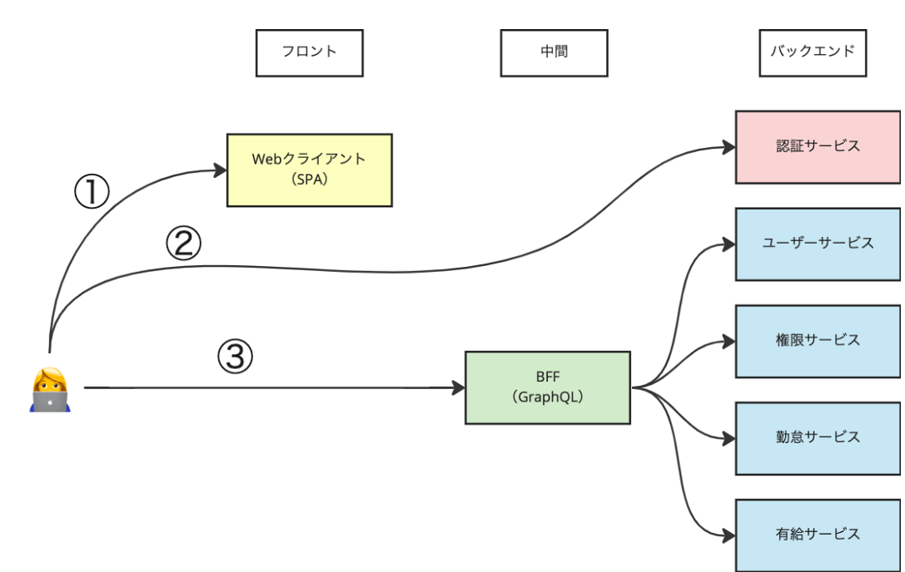

# マイクロサービスにおける認証方法と実装
## 2025/6/5
以下内容を実践。  
https://dev.classmethod.jp/articles/get-started-with-amazon-cognito-now-1/

## 今後やりたいこと
以下イメージ図と案件でやろうとしていること（川畑さんに相談）して、案件のアーキ図を整理して実装（フィージビリティ担保）までやりたい。

